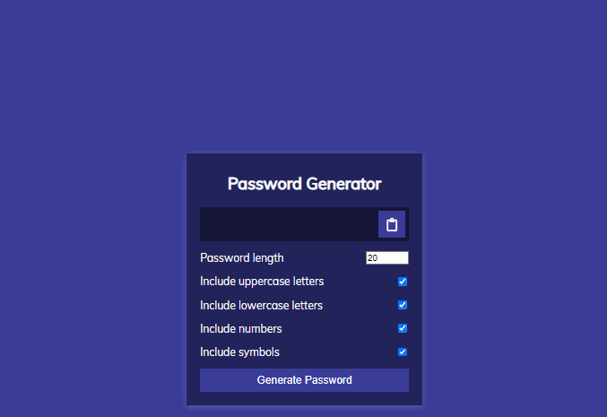

# Password Generator

This is a password generator application. Here the user can generate a minimum of four to a maximum of 20 random passwords where he can randomly generate passwords with lowercase letters, or uppercase letters, or numbers, or symbols. If you want, you can create 4 types together randomly. And can copy the entire generated password by clicking.

- A special JavaScript Special String method called `fromCharCode` is used to generate passwords randomly. Details : [String.fromCharCode()](https://developer.mozilla.org/en-US/docs/Web/JavaScript/Reference/Global_Objects/String/fromCharCode)
- This reference from w3school is used as a reference for HTML ASCII . [HTML ASCII](https://www.w3schools.com/charsets/ref_html_ascii.asp)

